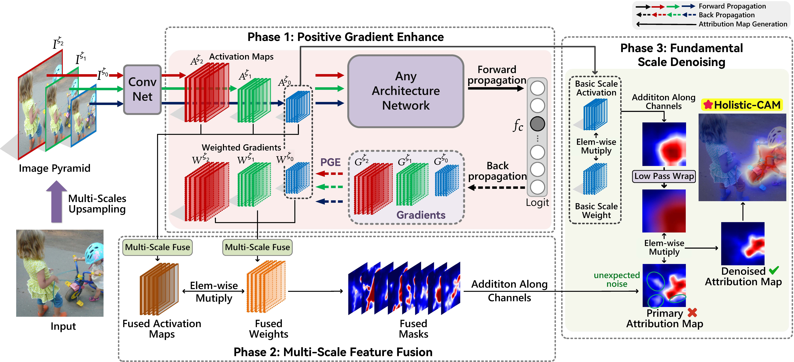

# Holistic-CAM: Ultra-lucid and Sanity Preserving Visual Interpretation in Holistic Stage of CNNs

Pytorch implementation of **Holistic-CAM: Ultra-lucid and Sanity Preserving Visual Interpretation in Holistic Stage of CNNs**, which is accepted by [ACM MM 2024](https://openreview.net/forum?id=O9Vuj6lzya "link").
<p style="text-align: center">

</p>
 


## 😄 Pipeline of Holistic-CAM:
<p style="text-align: center">

</p>


## 🔥 Compare with SOTA methods:
<p style="text-align: center">

</p>

## 🛠️ Requirements:
```
python 3.X
pytorch >= 1.5 (including torchvision)
matplotlib
opencv-python
No more other requirements
```

## 🗝️ How to Run:
```
use demo.ipynb
```
## ✏️ Citation:
```bibtex
@inproceedings{chen2024holisticcam, 
   title={Holistic-{CAM}: Ultra-lucid and Sanity Preserving Visual Interpretation in Holistic Stage of {CNN}s}, 
   author={Pengxu Chen and Huazhong Liu and Jihong Ding and Jiawen Luo and Peng Tan and Laurence T. Yang}, 
   booktitle={Proceeding of the ACM Intertional Conference on Multimedia}, 
   year={2024}, 
   url={https://openreview.net/forum?id=O9Vuj6lzya} 
}
```
## 📁 Supplementary material:
Due to the page limitations of ACM, we have placed the remaining ablation stduy and complete experimental results in the **supplementary.pdf**.
