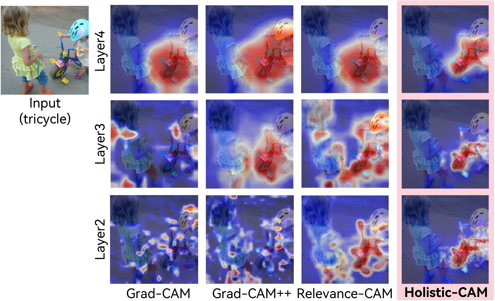

# Holistic-CAM: Ultra-lucid and Sanity Preserving Visual Interpretation in Holistic Stage of CNNs

This is implementation of **Holistic-CAM: Ultra-lucid and Sanity Preserving Visual Interpretation in Holistic Stage of CNNs**, which is accepted by [ACM MM 2024](https://openreview.net/forum?id=O9Vuj6lzya "link").
<p style="text-align: center">

</p>
 


### Pipeline of Holistic-CAM:
<p style="text-align: center">

</p>


### Compare with SOTA methods:
<p style="text-align: center">

</p>


### Citation
```
@inproceedings{chen2024holisticcam, 
   title={Holistic-{CAM}: Ultra-lucid and Sanity Preserving Visual Interpretation in Holistic Stage of {CNN}s}, 
   author={Pengxu Chen and Huazhong Liu and Jihong Ding and Jiawen Luo and Peng Tan and Laurence T. Yang}, 
   booktitle={ACM Multimedia 2024}, 
   year={2024}, 
   url={https://openreview.net/forum?id=O9Vuj6lzya} 
}
```

